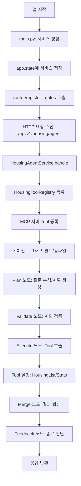
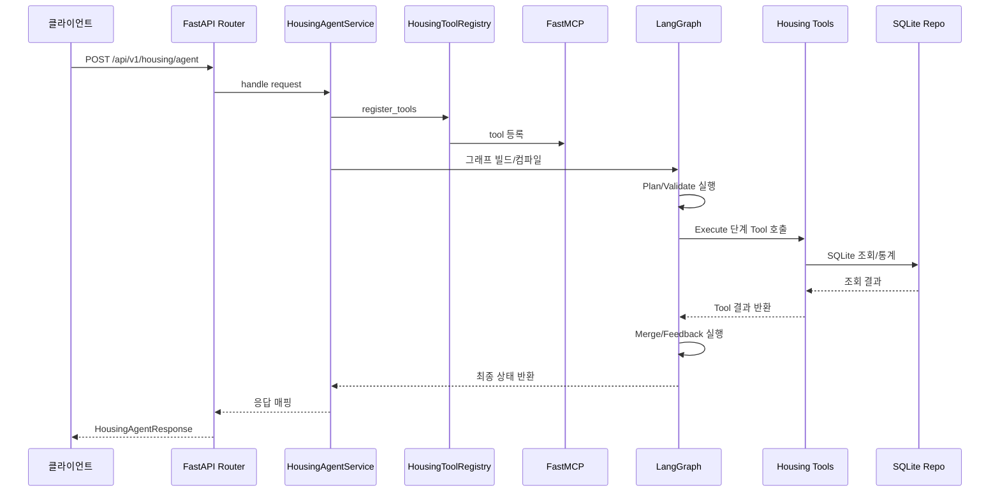

# fourthSession

이 프로젝트는 **주택 데이터셋(housing.csv)**을 기반으로 **Agent/Tool/MCP/LangGraph** 구조를 학습하기 위한 교육용 예제입니다.  
`Plan → Validate → Execute → Merge → Feedback` 흐름을 실제 동작 구조로 제공하며, 학습자가 단계별로 확장/개선할 수 있도록 설계했습니다.

## 프로젝트 목표

- Agent/Tool/MCP의 역할 분리 이해
- LangGraph 기반 Plan-and-Execute 흐름 구성
- SQLite 기반 데이터 접근 및 Tool 설계
- MCP 서버를 통한 Tool 카드 제공/실행 흐름 이해
- API 요청 → 에이전트 그래프 실행 → 응답까지 전체 흐름 확인

## 데이터

- 입력 CSV: `data/housing.csv`
- 앱 시작 시 CSV를 SQLite(`data/housing.db`)로 자동 적재합니다.

## 주요 디렉터리

- 애플리케이션 진입점: `src/fourthsession/main.py`
- Agent: `src/fourthsession/core/housing_agent`
- API: `src/fourthsession/api/housing_agent`
- Core: `src/fourthsession/core`
- MCP: `src/fourthsession/mcp`
- 데이터: `data/housing.csv`
- 작업 큐/스트림: `src/fourthsession/core/common/queue`
- 워커 베이스: `src/fourthsession/core/common/worker`

## 라우터 등록 구조

`refactor.md` 기준 구조를 따릅니다.

1) `main.py`에서 서비스 객체 생성  
2) 서비스 객체를 `app.state`에 저장  
3) 각 기능 패키지의 `router/__init__.py`에서 라우터 합성/등록  

동작 흐름 요약:

- `main.py`는 서비스 인스턴스를 만든 뒤 `app.state`에 저장한다.
- `register_routes(app)`는 `app.state`에서 서비스를 꺼내 라우터를 합성한다.
- 최종 라우터는 `app.include_router(...)`로 FastAPI 앱에 등록된다.

예시 흐름:

- 서비스 생성/주입: `src/fourthsession/main.py`
- 라우터 등록: `src/fourthsession/api/housing_agent/router/__init__.py`

## 실행 방법

### 1) 환경 설정

```txt
uv venv .venv
uv sync
```

### 2) FastAPI 실행

```txt
uv run uvicorn fourthsession.main:app --host 0.0.0.0 --port 8000 --reload
```

또는

```txt
uv run python -m fourthsession.main
```

## MCP 서버 실행

```txt
uv run --with mcp src/fourthsession/mcp/mcp_server.py
```

## Redis 설정

작업 큐/스트림은 Redis를 사용합니다. 기본값은 아래와 같습니다.

- `REDIS_HOST`: `localhost`
- `REDIS_PORT`: `6379`
- `REDIS_DB`: `0`

## 기본 엔드포인트

- 헬스 체크: `GET /health`
- 주택 에이전트: `POST /api/v1/housing/agent`
- 주택 작업 생성: `POST /api/v1/housing/jobs`
- 주택 작업 취소: `POST /api/v1/housing/jobs/{job_id}/cancel`
- 주택 작업 상태: `GET /api/v1/housing/jobs/{job_id}/status`
- 주택 작업 스트림: `GET /api/v1/housing/jobs/{job_id}/stream`

> 이 과제의 기본 흐름은 **비동기(작업 큐 + 스트림)** 입니다.  
> `POST /api/v1/housing/agent`는 비교/디버깅용 동기 실행 경로로 유지됩니다.

요청 예시:

```json
{
  "question": "침실 3개, 면적 700~1500 사이 주택 가격 통계 알려줘",
  "trace_id": "trace-001",
  "preferred_tools": ["housing_price_stats_tool"]
}
```

응답 예시:

```json
{
  "answer": "요청하신 조건의 가격 통계입니다. 표본 수는 120건이며 평균 3400000, 중앙값 3200000, 최소 1200000, 최대 9100000입니다.",
  "trace_id": "trace-001",
  "metadata": {
    "tool_results": [],
    "errors": [],
    "plan": {
      "version": "v1",
      "goal": "주택 질문에 맞는 데이터 조회 및 요약",
      "steps": []
    }
  }
}
```

## MCP/Tool 흐름 다이어그램

### 1) 플로우차트



### 2) 시퀀스 다이어그램



## 구현 구성 요약

- 그래프: `Plan → Validate → Execute → Merge → Feedback`
- Tool: `core/housing_agent/tools/housing_list_tool.py`, `core/housing_agent/tools/housing_price_stats_tool.py`
- 레포지토리: SQLite 기반 `housing_repository`
- MCP: FastMCP + Tool 카드 제공
- Core/Api 분리: 에이전트 로직은 `core/housing_agent`, API는 `api/housing_agent`에 위치
- 큐/메모리: Redis 리스트(rpush/lpop) 기반 스트림 큐 + 인메모리 작업 저장소

## 구현 위치 가이드

아래 경로에서 구현/확장을 진행하면 됩니다.

- 에이전트 그래프/노드: `src/fourthsession/core/housing_agent/graph`, `src/fourthsession/core/housing_agent/nodes`
- 에이전트 상태/프롬프트/상수: `src/fourthsession/core/housing_agent/state`, `src/fourthsession/core/housing_agent/prompts`, `src/fourthsession/core/housing_agent/const`
- 도구 구현: `src/fourthsession/core/housing_agent/tools`
- SQLite 레포지토리: `src/fourthsession/core/repository/sqlite`
- MCP 서버/레지스트리: `src/fourthsession/mcp`
- 작업 큐/스트림: `src/fourthsession/core/common/queue`
- 워커 베이스: `src/fourthsession/core/common/worker/worker_base.py`
- 작업 API(4종): `src/fourthsession/api/housing_agent/router`
- 작업 서비스: `src/fourthsession/api/housing_agent/service/housing_job_service.py`

## 테스트

테스트 코드는 `pytest` 기준으로 작성하며, **실행은 사용자가 직접 수행**해야 합니다.  
테스트 실행이 필요하면 명령어를 요청해 주세요.
